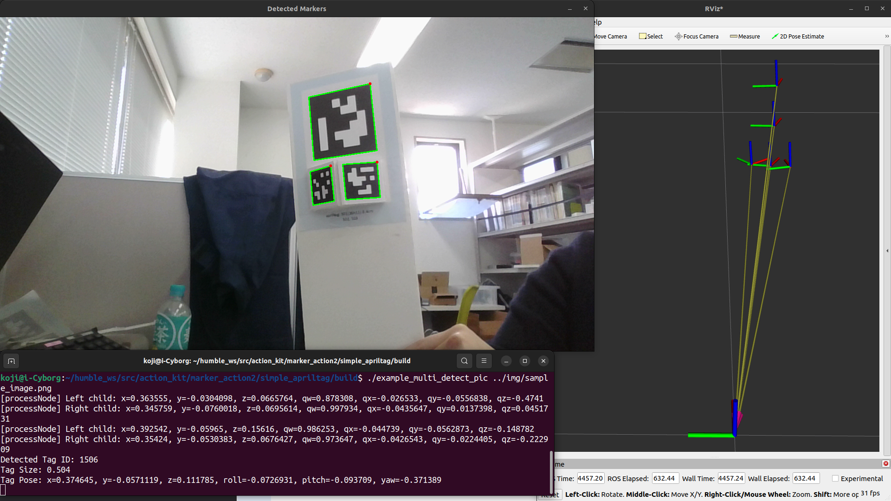

# 概要
シンプルなapriltag検出。
Go2における検出サンプル付き

# build apriltag

```
git clone https://github.com/AprilRobotics/apriltag.git
cd apriltag
mkdir build
cd build
cmake ..
make
sudo make install
```

# usgae
Docking StationのGUI上で下記を行う：
```
mkdir build
cd build
cmake ..
make
./example_detect_gst
```

# 3D tag

複数のTagを１つのTagとして検出することができる。
片方のTagからみた、もう片方の位置を最初に与えることで機能する。



Rvizで表示されているものは、
 - Apriltag id: 501
 - Apriltag id: 502
 - Apriltag id: 503
 - 502と503を合成したもの
 - 501と、502,503合成Tagを合成した、最終推定ポーズ
である。
